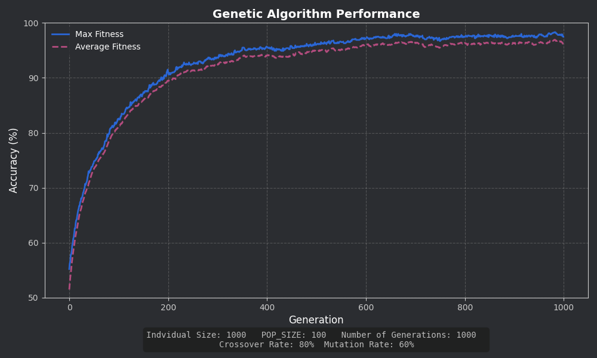
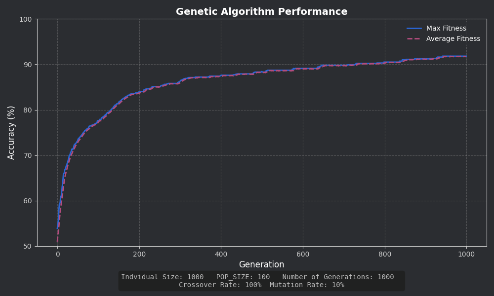

# OneMax with DEAP

This is a small project I built to learn how to use the DEAP library for genetic algorithms. It solves the OneMax problem, which involves evolving a binary list into all 1s.

## How It Works

Each individual in the population is a list of 0s and 1s. The fitness function simply counts how many 1s are in the list. Over generations, the algorithm selects the better individuals, crosses them over, and mutates them until it eventually reaches a perfect solution (all 1s).

## Optimal: 80% Crossover / 20% Mutation

## High Mutation

## Low Mutation, 100% Crossover

## Sample Output

This is what it looks like with `IND_SIZE = 500`:

```
Gen 0: Max Fitness = 295.0
Gen 1: Max Fitness = 306.0
Gen 2: Max Fitness = 305.0
...
Gen 72: Max Fitness = 499.0
Gen 73: Max Fitness = 500.0
...
Gen 99: Max Fitness = 500.0
Best individual: [1, 1, 1, ..., 1]
Fitness: 500.0
```

## File Overview

* `main.py` – runs the algorithm
* `config.py` – holds parameters like population size and mutation rate
* `setup_ga.py` – sets up the DEAP toolbox and individual structure
* `evaluate.py` – defines the fitness function
* `evolution.py` – handles the genetic algorithm loop
* `requirements.txt` – just DEAP for now

## Running It

I used a virtual environment

```bash
python -m venv .venv
.venv\Scripts\activate on Windows

pip install -r requirements.txt
python main.py
```
